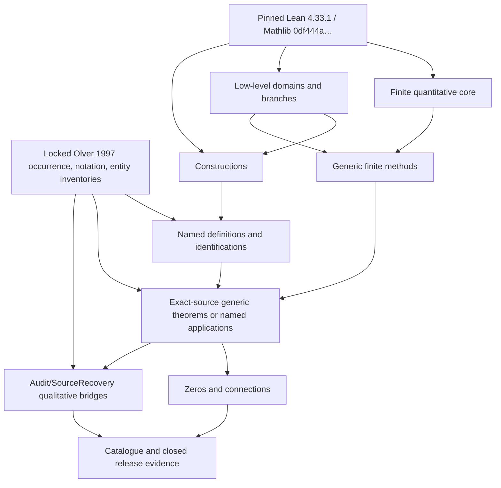
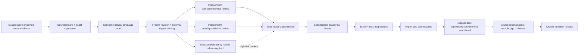
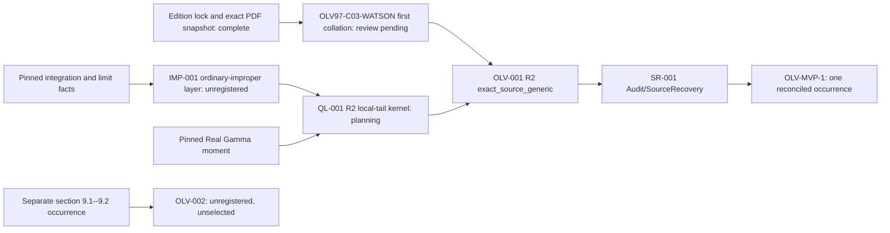

# LMLF dependency and execution graph

**Normative owner:** `jaumededios`  
**Status:** planning index; graph edges do not authorize uncarded work

This file composes the core roadmap and specialist queues into one dependency
view.  A solid dependency below means mathematical or governance evidence must
already be accepted.  A planning arrow does not make either endpoint a theorem
card.  Current registration and lifecycle truth comes from the
[card inventory](inventory/cards.csv), [manifest inventory](inventory/manifests.csv),
[theorem cards](theorem_cards/README.md), and externally bound review records.

## Global layer invariant



Forbidden reverse edges are as important as the arrows:

- the quantitative core never imports named-function modules;
- a named construction never imports asymptotics that later consume it;
- a residual identity never imports or assumes its solution-error estimate;
- generic conditional infrastructure never imports an application merely to
  discharge its own hypotheses;
- semantic modules never import `Audit`, tests, or tactics; and
- qualitative recovery, source navigation, and release metadata never feed
  back into the semantic proof of a finite theorem.

Definitions may use minimal exact branch/series/ODE support, but not remainder
methods.  Audit modules are separately built consumers of public declarations.

## Proof-before-Lean gate graph



For a source-equivalent reuse wrapper, `NLP` may be explicitly `not_required`,
but the card, pin, source-signature comparison, reviews, candidate binding, and
release gates remain.  For new mathematics, both ordinary pre-Lean reviews are
mandatory.  Definition/continuation, transition, zero, and connection packets
also require the third review.  No structure field, chosen object, `sorry`, or
global axiom may bypass a missing edge.

## Current registered nodes

| Node | Manifest | Current gate | Next legitimate edge |
|---|---|---|---|
| `QB-001` | `BOOTSTRAP-0` | frozen eight-signature specification retains its pre-authorization self-status; external evidence authorized and accepted the exact implementation at `515b742f7ad5472c17cfdf0fda7cbc83c5585da1` | reuse the public finite core where justified; any larger API requires a new card |
| `DEF-001` | `BOOTSTRAP-0` | frozen four-declaration specification retains its snapshot self-status; external evidence authorized and accepted the exact implementation at `515b742f7ad5472c17cfdf0fda7cbc83c5585da1` | reuse the transparent Gamma wrappers only when a consumer benefits; do not make Watson depend on them gratuitously |
| `QL-001` | `OLV-MVP-1` planning | revision-2 draft card and complete draft proof; exact signature absent | extract and accept IMP-001, review the generic kernel, then freeze |
| `OLV-001` | `OLV-MVP-1` planning | locked occurrence transcribed but independently unreconciled; revision-2 complex-source card/proof present | source review, accepted QL-001, exact signatures, proof/card quorum |
| `SR-001` | `OLV-MVP-1` planning | no card or proof | accepted `OLV-001`, eventual-domain/scale/notation bridge, audit-only implementation |

`DEMO-0` is not closed.  Its candidate names express intent only.
`BOOTSTRAP-0` was closed and execution-ready before its separate external gate;
manifest readiness alone did not authorize Lean.  The later external records
did authorize and accept the exact `515b742...` implementation.  This does not
claim an Olver occurrence or a tagged release.

`IMP-001` is a deliberately unregistered revision-3 draft for the small
ordinary-improper/finite-exceptional primitive layer upstream of QL-001.  Its
six prospective targets have a complete revised author proof and two
fresh-context exact-byte approvals. Its compiled exact-signature proposal is
frozen for independent API review. The name and boundary remain provisional
until registry reconciliation, and external authorization remains required before Lean;
it must not be smuggled into QL-001 as an unreviewed implementation detail.

## Watson MVP: only source critical path



The source snapshot, printed label, proposition, order convention, relevant
page map, notation/entity draft links, and transcription digest now exist.  The
revision-2 design uses the source-supported complex codomain, with a real
corollary, and reads the book's ordinary convergence as independent one-sided
convergence at a finite exceptional set.  Mathlib's Bochner `intervalIntegral`
represents every regular finite piece, with explicit `IntervalIntegrable`
evidence; only endpoint passages are improper, and no second proper-Riemann
library is planned.  A continuous normalized primitive with a regular-piece
increment law is the proposed generic bridge; the whole-set Bochner route is
only an absolute-integrability adapter.  These choices and the collation
still require independent approval.  OLV-001 chooses one common baseline
`X > 0` before `n`, while `k_n`, `K_n`, and `L_n` may depend on `n`.  The occurrence-card
join uses `exact_source_target`, and the inventory validator requires that role
for an `exact_source_generic` card; this structural consistency does not
substitute for review.

Explicitly absent from this graph: Airy, Cauchy derivative transport,
oscillatory/contour methods, Euler--Maclaurin, ODE residual/stability,
turning-point comparison, zeros/connections, and tactics.

## Track A: function construction and identification

The common family dependency is:

```text
locked body occurrence + notation/entity resolution + pinned reuse audit
  -> actual construction, only if reuse is insufficient
  -> conventional specification and uniqueness/identification
  -> real agreement, branches, exceptions, exact identities
  -> separately built definition audits
  -> comparison properties and positive zero-safe envelopes
  -> named finite applications
```

The [family overview](families/README.md) owns the common gate.  Its bounded
planning queues are:

| Family | Queue roots and order | Downstream seams |
|---|---|---|
| [Gamma-related](families/gamma_related.md) | existing `DEF-001`; then `DEF-GAM-002`--`005`, `DEF-IGAM-001`--`003`, `AUD-GAM-001` | Laplace moments, Stirling, ratios, incomplete-Gamma applications |
| [Airy and Scorer](families/airy_scorer.md) | review the bounded locked transcriptions; `CON-AIR-001` -> `DEF-AIR-001`; then integral/rotation/Scorer cards, `CMP-AIR-*`, `AUD-AIR-001` | turning points, contours, inhomogeneous models, zeros, connections |
| [Bessel/cylinder](families/bessel_cylinder.md) | shared `DEF-HG0F1-001` -> first-kind objects -> parameter continuation -> second-kind/Hankel; `CMP-BES-*`, `AUD-BES-001` | simple-pole comparison, saddle/large-order applications, zeros/connections |
| [Hypergeometric/Legendre/Whittaker](families/hypergeometric_legendre.md) | local regularized substrate -> local series -> continuation -> Kummer/Legendre/Whittaker bridges -> audit | Airy/Bessel construction candidates, Barnes/Darboux, parabolic-cylinder functions |
| [Remaining portfolios](families/remaining_families.md) | separate exponential-integral, error/Dawson/Fresnel, parabolic-cylinder, per-orthogonal-family, zeta/Bernoulli, Anger/Struve/Nicholson, and per-auxiliary queues | admitted only for explicitly collated consumers |

These branches may run in parallel after their own source and reuse audits.
There is no “all functions” packet, and patterns such as
`DEF-ORTH-<MEMBER>-001` or `DEF-AUX-<ENTITY>-001` are not wildcard
authorizations.  A family blocked on continuation does not block a generic
method or another family.

Before registration, the coarse demonstrator/transition handles `DEF-002` and
`DEF-003` must be reconciled with the granular family handles `DEF-AIR-*` and
`DEF-BES-*`.  They currently describe overlapping planned work and must not be
treated as four accepted constructions or as resolved dependency IDs.

## Track B: integral, contour, summation, and transfer methods

### Finite Laplace branch

The [Laplace queue](methods/integral_laplace.md) is:

```text
pinned integration/limit facts -> IMP-001 -> QL-001
pinned Real Gamma moment ---------------------> QL-001
collated Watson + accepted QL-001 -> OLV-001 -> SR-001
separate section 9.1--9.2 occurrence -> OLV-002
QL-003 optional exponential-growth adapter; EX-002 independent regression
```

`IMP-001` has an unregistered revision-3 card/proof draft and a six-declaration
signature proposal under API review. It separates relational ordinary-
improper semantics, the finite-exceptional primitive certificate, and the
finite-piece Abel/Fubini identity from the QL estimate.  Its regular pieces use
Mathlib `intervalIntegral`.  QL-001 is a complete-normed-real-vector-space
local-tail kernel;
OLV-001 specializes it to the source-supported complex scalar theorem and then
provides a real corollary.  QB-001 and DEF-001 are optional future packaging or
audit joins, not dependencies of these revision-2 proofs.  OLV-002 remains
outside the MVP path.  `EX-002` permanently demonstrates that valid finite
bounds for every order do not imply convergence in order.

### Oscillatory and contour branch

The [oscillatory/contour queue](methods/oscillatory_contour.md) has three
independent early roots and a later join:

```text
QB-001 + interval integration by parts -> OI-001 -> OI-002 -> OI-003
QB-001 + curve integrals              -> CT-001 -> CT-002
selected exact model moments          -> SP-001
OI-002 + SP-001                       -> SP-002 stationary phase
CT-001 + CT-002 + SP-001              -> SD-001 simple saddle
CT-002 + SD-001 + branch support      -> COAL-001 constructed coalescence
```

Conditional improper integrals are explicit limits, not silently totalized
whole-line Bochner integrals.  Named applications must construct their
contours, prove branch containment and decay, and discharge the generic
majorants.  This entire branch is off the Watson path.

### Summation and coefficient-transfer branch

The [summation queue](methods/summation.md) deliberately permits parallel
roots:

```text
QB-001 + finite sums -> SUM-001
DEF-BERN-001 -> DEF-BERN-002 -> BER-001
pinned Bernoulli facts ----------------> BER-001
SUM-001 + BER-001 + integration by parts -> EM-001 -> EM-002
pinned Cauchy coefficient facts -> CF-001 -> CF-002
CF-002 + branch/contour support -> DAR-001
collated Chapter 8 transform + selected integral/contour support -> ILT-001
```

The locked Chapter 8 §1 source identity and exact remainder are transcribed but
unreviewed. `DEF-BERN-001` identifies the numbers/polynomials without project
declarations; `DEF-BERN-002` separately identifies the source periodization;
`BER-001` is only a real-line facade and calculus/envelope infrastructure after
those source identifications are accepted.
`ILT-001` remains unclassified until direct source selection.  Darboux and
inverse-Laplace packets must construct the needed contour instead of placing
the desired geometry and bound into an input structure.

## Tracks C and D: ODE, complex derivatives, and transitions

### Domain, branch, and derivative seam

The [domain/branch queue](methods/complex_domains_branches.md) and
[derivative-transport queue](methods/derivative_transport.md) compose as:

```text
QC-DOM -------------------------------> QC-RADIUS
pinned principal log/power -> CB-PRINCIPAL -> CB-GENERIC -> QC-LOGCOORD
pinned real restriction -------------> QC-REAL
QB-001 + pinned Cauchy theorem --------> QC-CAUCHY -> QC-RADIUS
QC-DOM + QC-REAL + QC-RADIUS ----------> EX-001 and QC-NEG-DERIV
stable scalar consumers --------------> QC-JET / QC-MIXED / QC-GAUGE later
```

The M3 exit includes only the initial domain, real-restriction, Cauchy/radius,
`EX-001`, and negative-regression slices.  Generic branch existence and
continuation require the extra circularity review.  Openness alone is not an
explicit radius; real-axis smallness plus entire extension is not a derivative
bound; spatial analyticity is not parameter analyticity.

### ODE residual and stability seam

The [ODE queue](methods/ode_residual_stability.md) is:

```text
QB-001 -> ODE-001 residual algebra
ODE-001 -> ODE-002 exact gauge/variable transform
ODE-001 -> ODE-003 path-system pullback
ODE-003 -> ODE-004 Duhamel identity/bound -> ODE-010 scaled jets
ODE-004 + integral core -> ODE-005 Volterra factorial iteration -> ODE-008 improper endpoint
ODE-004 + pinned fixed-point API -> ODE-006 contraction
ODE-003 + pinned ODE API -> ODE-007 finite-IVP normalized solution -> ODE-009 progressive paths
ODE-001 + stability + normalization + scaled jets -> ODE-011 fixed-solution all-orders transfer
```

`ODE-002` is not a prerequisite of generic Volterra stability.  A residual
bound is not a solution bound; `ODE-011` must expose normalization mismatch and
propagator/Volterra loss, and its one exact solution is quantified outside the
approximation order.

### Turning-point and pole comparison seam

The [transition queue](methods/turning_points.md) is downstream of accepted
named models and generic ODE work:

```text
branch support -> TP-001 turning coordinate
ODE-002 + TP-001 -> TP-002 exact Liouville normal form
identified Airy basis + ODE-010 -> TP-003 frame/envelope
identified Airy basis + TP-002 -> TP-004 exact finite residual
TP-003 + TP-004 + ODE-009 -> TP-005 explicit residual/path bound
ODE-011 + TP-003 + TP-005 -> TP-006 uniform fixed-solution stability
TP-002 + TP-006 -> TP-007 original value/derivative transport
TP-007 + accepted outer expansion -> TP-008 overlap matching
TP-006 + parameter-Cauchy infrastructure -> TP-009 mixed derivatives

branch support + ODE-002 -> BP-001 normal form
BP-001 + ODE-011 + identified Bessel basis/frame/envelopes -> BP-002 pole-domain stability
```

Every transition node uses the three-review gate.  Coordinates, paths,
removable singularities, positive envelopes, and branch consistency must be
constructed.  A record that assumes them proves only a conditional theorem.

## Track E: zeros, connections, and source recovery

The [zeros/connection queue](methods/zeros_connections.md) separates local from
global claims:

```text
real calculus -> ZERO-001 local existence -> ZERO-002 local uniqueness
complex-analysis foundation -> ZERO-003 counting -> ZERO-004 one-zero disk
ZERO-002 or ZERO-004 -> ZERO-005 injective local labels
ZERO-005 + real ODE/phase -> ZERO-006 real exhaustion
ZERO-003 + ZERO-005 + contour bounds -> ZERO-007 complex exhaustion
local labels + an exhaustion route + accepted named estimate -> ZERO-008 named indexed zeros

ODE path/normalization + matrix audit -> CONN-001 frame/matrix
CONN-001 -> CONN-002 cocycle and CONN-003 Wronskian coefficients
ODE endpoint/path theory + CONN-001 -> CONN-004 sectorial connections
CONN-003/004 + named identifications -> CONN-005 exact named matrix
ODE scaled estimates + CONN-002 -> CONN-006 quantitative matrix stability
```

The pinned audit has not established a ready Rouché/argument-principle theorem;
`ZERO-003` therefore begins with a bounded feasibility/reuse investigation.
One local disk never implies global indexing.  A small finite overlap error
never identifies an exact Stokes multiplier.

Accepted finite source results then feed only forward into
[qualitative source recovery](qualitative/source_recovery.md):

```text
quantitative producer
  -> eventual-domain witness
  -> exact scale comparison
  -> notation/normalization equality
  -> source-facing qualitative theorem in Audit/SourceRecovery
  -> occurrence reconciliation and closed release
```

`HasErrorFamily` alone supplies no asymptotic scale, eventual-domain proof, or
convergence in order.  The [documentation graph](qualitative/navigation_and_docs.md)
and [release strategy](qualitative/release_strategy.md) expose both the finite
producer and the audit theorem without merging their status.

## Automation is a leaf, not a prerequisite

The [tactic plan](automation/tactics.md) admits automation only after accepted
manual consumers demonstrate stable proof shapes:

| Candidate | Minimum evidence before a packet is drafted | Permitted role |
|---|---|---|
| `bound_calc` | three stable manual consumers in at least two modules/packets and at least three rule shapes | compose accepted finite-bound theorems and expose sign/domain/margin goals |
| `cauchy_bound` | at least three stable explicit-radius proofs with two geometries, order-zero/positive-order cases, a nontrivial weight comparison, and a real-facing consumer | apply an accepted Cauchy wrapper to an explicitly chosen radius |
| `residual_nf` | two distinct ODE families with accepted manual residual proofs and a shared normalization pattern | prove exact finite residual identities only |

No tactic chooses a radius, contour, branch, truncation order, target function,
or unnamed constant.  Tactic modules are opt-in leaves and never enter semantic
foundations.  The [contract linter](automation/contract_linting.md) and
[CI plan](automation/testing_and_ci.md) likewise validate evidence without
creating proofs, reviews, status transitions, or source coverage.

## Parallel execution matrix

| May proceed together | Required join before downstream work |
|---|---|
| independent Watson collation review; IMP-001 design/proof; revision-2 QL/OLV review; later QB/DEF maintenance | exact OLV card waits for reviewed collation and accepted IMP/QL layers; QB/DEF join only for optional packaging or audit wrappers |
| M3 derivative demonstrator; M4/M5 source path | no join; M3 is explicitly off-path |
| OI, CT, elementary SUM, and CF early roots | join only for a named application that uses several methods |
| ODE residual algebra, path-system representation audit, and named-family body audits | comparison application waits for both accepted method and identification nodes |
| independent Gamma, Airy, Bessel, and other family waves | a cross-family theorem waits only for the families it names |
| schema/linter fixtures and documentation generation | enforcement/release waits for stable schemas and exact artifact bindings |

An open research node blocks only the exact packets citing it.  It never
expands a closed manifest or delays an unrelated accepted path.

## Open dependency questions

The [research queue](qualitative/open_research_questions.md) is the authoritative
discussion layer.  The highest-impact unresolved edges are:

1. `RQ-SRC-001`, `RQ-WAT-001`, `RQ-QUAL-001`: review the collated Watson text,
   its complex/ordinary-improper interpretation and common-`X` quantifier order, freeze
   the finite theorem, and complete source recovery.
2. `RQ-INT-001`: independently review and reconcile the unregistered IMP-001
   exact signatures for the ordinary-improper relation/primitive layer and
   Mathlib-interval-integral Abel/Fubini lemma; scope any narrower whole-set
   Bochner adapter separately.
3. `RQ-CAUCHY-001`: useful constrained radii on moving domains.
4. `RQ-AIRY-001`, `RQ-BESSEL-001`, `RQ-PARAM-001`: noncircular constructions,
   exceptional parameters, and joint regularity.
5. `RQ-CODE-001`, `RQ-FIXED-001`, `RQ-PATH-001`: minimal complex-ODE support,
   fixed-solution quantifiers, and constructed progressive paths.
6. `RQ-TURN-001`, `RQ-POLE-001`, `RQ-COAL-001`: positive zero-safe envelopes
   and uniform normal-form geometry.
7. `RQ-SUM-001`, `RQ-FROB-001`: source-facing Euler--Maclaurin and resonant
   regular-singular analysis.
8. `RQ-ZERO-001`, `RQ-INDEX-001`, `RQ-CONN-001`: local perturbation, global
   counting, and scale-sensitive connection data.

A proposed answer becomes an executable edge only after it is split into
finite cards with exact public signatures, a complete natural-language proof,
the required independent approvals, and accepted dependencies at immutable
commits.
